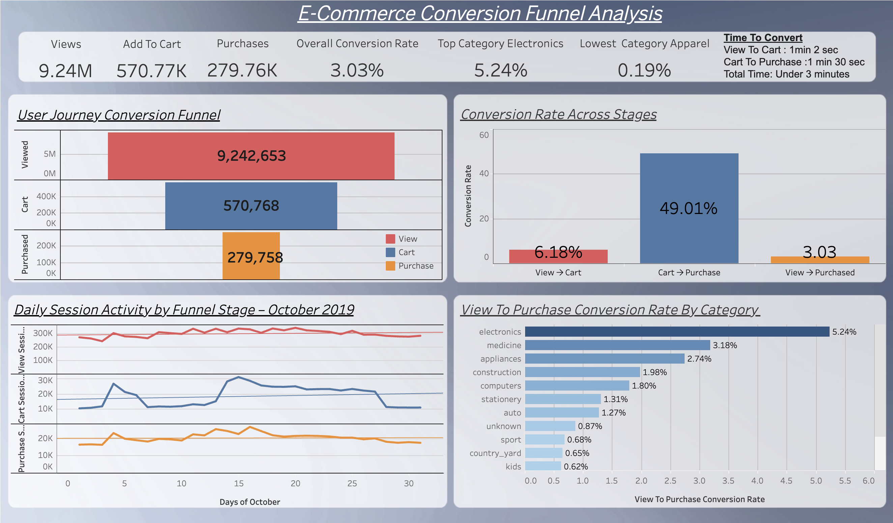

# Conversion Funnel Analysis for E-Commerce Multi-Category Online Store

Analyzed 42M+ e-commerce events to map the **View → Cart → Purchase** funnel, uncovering a 93.8% drop-off before cart and category-level conversion gaps, with actionable recommendations and an interactive Tableau dashboard.

**Business Question:** Where do shoppers abandon the purchase journey, and which product categories convert best?

---

## 📊 Live Dashboard

[View the interactive dashboard on Tableau Public](https://public.tableau.com/views/E-CommerceConversionFunnelAnalysis_17829558379790/FunnelAnalysisOctober20193?:language=en-US&:sid=&:redirect=auth&:display_count=n&:origin=viz_share_link)



---

## Dataset

**Source:** [Kaggle — E-commerce Behavior Data from Multi Category Store](https://www.kaggle.com/datasets/mkechinov/ecommerce-behavior-data-from-multi-category-store?select=2019-Oct.csv)

- **42,448,764 raw events** from October 2019, covering View, Cart, and Purchase actions
- **Key fields:** `event_time`, `event_type`, `user_session`, `category_code`, `price`, `brand`, `product_id`

The raw CSV is not included in this repo due to size (5.67GB on disk). To reproduce the analysis, download the file from the Kaggle link above and place it in `data/raw/`.

---

## Key Findings

### Funnel Performance
| Stage | Conversion Rate | Drop-off |
|---|---|---|
| View → Cart | 6.18% | 93.82% |
| Cart → Purchase | 49.01% | 50.99% |
| View → Purchase (overall) | 3.03% | 96.97% |

>**The largest drop-off happens before the cart stage** — pointing to opportunities in product discoverability, pricing clarity, and landing page relevance, rather than checkout friction.


### Daily Activity Patterns

**View Sessions:**
- Spiked from 239,850 (Oct 3) to 299,315 (Oct 4)
- A second rise brought views from 261,852 (Oct 7) to 306,761 (Oct 8)
- Views held steady above 300K from Oct 8 through Oct 23 (309,009), then declined for the remainder of the month, ending at 280,002 on Oct 31

**Cart Sessions:**
- Jumped from 11,527 (Oct 3) to 26,663 (Oct 4) — more than doubling in a single day
- A second, larger spike ran from 12,401 (Oct 12) to 31,090 (Oct 15)
- Cart activity then declined steadily through Oct 27 (21,379), before dropping sharply to 10,726 by month end

**Purchase Sessions:**
- Rose from 16,154 (Oct 3) to 22,933 (Oct 4)
- Increased again from 18,652 (Oct 10) to 25,212 (Oct 13)
- Peaked at 26,503 (Oct 16), then declined steadily to 17,320 by month end

>**Insight:** Cart sessions grew far more sharply than either Views or Purchases during both spikes. On Oct 3–4, Cart activity grew ~131% (11,527 → 26,663) while Views grew only ~25% and Purchases ~42% over the same day. This gap is even more pronounced in the second window: Views stayed essentially flat (~300K throughout Oct 8–23), yet Cart sessions grew ~151% (12,401 → 31,090), while Purchases grew only ~42% (18,652 → 26,503) over a comparable stretch. Cart-adding behavior consistently outpaced both browsing and buying during these windows.

>The cause isn't identifiable from this dataset alone (no promotional or campaign data is included), but the pattern suggests an opportunity to investigate checkout friction or purchase hesitation specifically during high cart-activity periods.

### Category Performance

**Top converting categories (overall):**
1. Electronics — 5.24%
2. Appliances — 2.74%
3. Construction — 1.98%
   
>**Medicine actually ranks 2nd overall at 3.18% — ahead of Appliances**
However, **Medicine only had 3,957 views and 126 purchases total, a tiny fraction of Electronics' 4M+ views and 214K+ purchases**

>Given this low volume, Medicine is excluded from "Top Performers" — the rate is fairly precise but the traffic isn't large enough to be strategically actionable
Full unfiltered breakdown (including Medicine, with view counts) is available in the Tableau dashboard

**Lowest converting categories (overall):**
1. Apparel — 0.19%
2. Furniture — 0.35%
3. Accessories — 0.52%

*Note: 27% of sessions had missing `category_code` values, labeled "unknown" rather than dropped, to avoid skewing results.*

### Customer Behavior Timing
- **Median time, View → Cart:** 1 minute
- **Median time, Cart → Purchase:** 1.5 minutes

Shoppers who show intent move through the funnel quickly.

---

## Recommendations

**1. Increase View → Cart engagement (biggest drop-off)**
Improve product landing pages (clearer pricing, stronger imagery, better CTAs), add trust signals (reviews, delivery estimates, return policy), and highlight differentiation from competitors.

**2. Optimize high-performing categories (Electronics, Appliances)**
Offer express/guest checkout, add more payment options (PayPal, Apple Pay, installment plans), use real-time low-stock nudges, and trigger cart-recovery emails/SMS for hesitant shoppers.

**3. Improve low-performing categories (Apparel, Furniture)**
Add detailed size guides, lifestyle/review videos, 360° product views, and clearer return policies. For furniture specifically, improve scale representation (photos with people/rooms), delivery time expectations, and AR placement tools.

**4. Fix missing category tracking**
27% of sessions lack category data — resolving this would materially improve attribution and category-level reporting accuracy.

**5. Improve conversion during high-traffic periods**
Cart activity nearly doubled during two windows in October, but purchases didn't scale proportionally suggesting checkout friction or hesitation increases under higher demand. Consider ensuring checkout infrastructure scales with traffic, adding urgency messaging during high-activity windows, and sending targeted cart-recovery nudges during and immediately after these periods.
---

## Tech Stack
- **Python** (pandas, NumPy) — data cleaning, transformation, funnel calculations
- **Plotly** — exploratory visualizations
- **Tableau Public** — interactive dashboard
- **Jupyter Notebook** — analysis environment

---

## Project Workflow
```
1. Data Cleaning (Jupyter)      →  Remove duplicates, handle nulls, transform dtypes
2. Funnel Calculation (Jupyter) →  Session-level metrics, conversion rates
3. Export for Visualization     →  Clean CSVs for Tableau
4. Dashboard Creation (Tableau) →  Interactive funnel and category performance
5. Final Report                 →  Executive summary + recommendations
```

## Repository Structure
```
Conversion-Funnel-Analysis/
├── README.md
├── LICENSE
├── conversion_funnel_analysis.ipynb
├── data/
│   ├── raw/                  # Download 2019-Oct.csv from Kaggle and place here
│   └── processed/            # Cleaned/aggregated CSVs used for Tableau
├── figures/                  # Exported chart screenshots
└── dashboard/
    ├── tableau_dashboard_screenshot.png
    └── dashboard_link.md
```

## How to Reproduce
1. Download `2019-Oct.csv` from the [Kaggle dataset](https://www.kaggle.com/datasets/mkechinov/ecommerce-behavior-data-from-multi-category-store?select=2019-Oct.csv) and place it in `data/raw/`
2. Install dependencies: `pandas`, `numpy`, `plotly`
3. Open and run `conversion_funnel_analysis.ipynb`
4. Processed CSVs will be written to `data/processed/`

---

## License
This project is licensed under the MIT License — see [LICENSE](LICENSE) for details.
